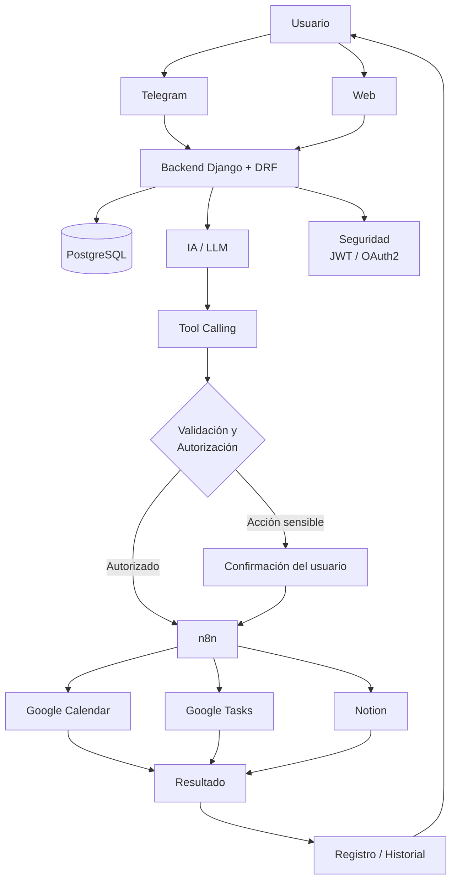

# Diagrama de arquitectura

Este diagrama combina el diagrama de arquitectura de la sección 7 con el flujo de validación/confirmación descrito en las secciones 6 y 12. No agrega componentes fuera de lo ya decidido en la Biblia. 