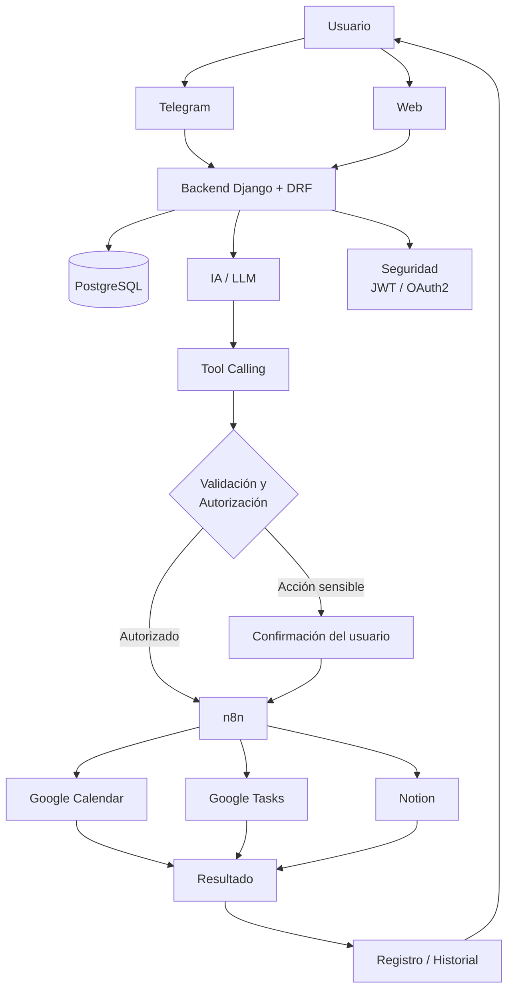

# Arquitectura del MVP — KEFA AI
## 1. Objetivo

Documentar la arquitectura del MVP de KEFA AI y la responsabilidad de cada componente, reflejando únicamente lo ya decidido por el equipo. Ninguna sección de este documento describe como "definido" algo que todavía no se ha decidido — esos puntos quedan marcados explícitamente como **pendiente**.

---

## 2. Diagrama de arquitectura



Este diagrama combina el diagrama de arquitectura de la sección 7 con el flujo de validación/confirmación descrito en las secciones 6 y 12. No agrega componentes fuera de lo ya decidido en la Biblia. 

**Principio fundamental que rige todo el flujo (Biblia, sección 6):**

> La IA propone una acción. El sistema decide si la acción está permitida. Después se ejecuta.

---

## 3. Backend (Django + DRF)

- **Responsable:** Kevin (Integrante 1).
- **Objetivo:** exponer la API REST que conecta Telegram/Web con el resto del sistema; es el único componente con acceso directo a PostgreSQL y a la ejecución de Tool Calling.

**Responsabilidades:**

- Autenticación de usuarios (JWT).
- Persistencia de datos (usuarios, historial, acciones).
- Recepción de mensajes desde Telegram/Web.
- Orquestar la llamada al módulo de IA y recibir la propuesta de Tool Calling.
- Aplicar validación y autorización antes de ejecutar cualquier acción.
- Disparar la ejecución hacia n8n una vez autorizada la acción.
- Registrar el resultado.

**Estado actual:** ya existe código real (`backend/Dockerfile`, `backend/docker-entrypoint.sh`).

**Pendiente:** endpoints exactos y modelos de datos concretos — se documentarán en `docs/api/` cuando existan.

---

## 4. PostgreSQL

- **Responsable:** Kevin.
- **Objetivo:** persistencia de usuarios, historial de conversación, acciones ejecutadas y su resultado.
- **Entradas:** escritura desde el Backend únicamente.

**Regla dura:** la IA nunca accede directamente a la base de datos (Biblia, sección 5).

**Pendiente:** diseño de esquema (tablas, relaciones) — no se documenta como definido hasta que exista una propuesta de modelos.

---

## 5. IA / LLM

- **Responsable:** Fanny (Integrante 2).
- **Objetivo:** interpretar lenguaje natural, identificar intención, extraer parámetros y proponer una herramienta del catálogo autorizado.

**Lo que SÍ hace:**

- Interpretación de instrucciones.
- Extracción de parámetros.
- Selección de la tool candidata.
- Mantención de contexto conversacional.
- Generación de la respuesta al usuario.

**Lo que NO hace (restricción dura, Biblia sección 5):**

- Ejecutar código arbitrario.
- Acceder a la base de datos.
- Inventar herramientas fuera del catálogo.
- Obtener credenciales directamente.
- Ejecutar fuera del catálogo autorizado.

**Decisión pendiente:** proveedor final del LLM (OpenAI API vs. Claude API). Mientras tanto, `.env.example` mantiene ambas variables (`OPENAI_API_KEY`, `ANTHROPIC_API_KEY`) como placeholder.

---

## 6. Tool Calling

- **Objetivo:** capa intermedia que traduce la intención de la IA en una acción concreta y validable — nunca ejecutable directamente por el modelo.

**Cada Tool del catálogo debe documentarse con:**

- Nombre.
- Descripción.
- Parámetros/schema.
- Permisos.
- Nivel de riesgo.
- Validaciones.
- Método de ejecución.
- Manejo de errores.

**Catálogo inicial de ejemplo** (Biblia, sección 11 — aún no cerrado ni exhaustivo):

```text
calendar.create_event
calendar.get_events
calendar.update_event
calendar.delete_event

tasks.create
tasks.list
tasks.complete
tasks.delete

notion.create_page
notion.search
notion.update_page
```

**Pendiente:** definir cuáles de estas (u otras) entran al MVP vs. cuáles quedan como opcionales.

---

## 7. n8n

- **Responsable:** Eric (Integrante 3).
- **Objetivo:** ejecutar la automatización final una vez que la acción fue validada y autorizada por el Backend; conecta con Google Calendar, Google Tasks y Notion.

**Configuración vigente (KEFA-ADR-004 ✅ APPROVED):**

- Imagen oficial: `docker.n8n.io/n8nio/n8n`, versión fijada `2.40.7` (nunca `latest`/`next`/`nightly`).
- Backend de base de datos: PostgreSQL (`n8n_db`, base separada dentro del mismo servidor).
- Credenciales sensibles vía Docker secret (`_FILE`), nunca como variable plana.

**Regla vigente:** los workflows exportados (`n8n/workflows/*.json`) se versionan pero deben sanitizarse antes de comitear (documentado en `n8n/README.md`).

**Pendiente real para poder levantar el entorno:** faltan `secrets/postgres_password.txt` y `docker/postgres/init-n8n-db.sh` (ver `control-de-estado.md`, secciones 1 y 5).

---

## 8. APIs externas

| Servicio | Uso previsto | Estado |
|---|---|---|
| Telegram Bot API | Canal principal de entrada del MVP | Por implementar |
| Google Calendar API | Crear/leer/actualizar/eliminar eventos | Por implementar |
| Google Tasks API | Crear/listar/completar/eliminar tareas | Por implementar |
| Notion API | Crear/buscar/actualizar páginas | Opcional en MVP (Biblia, sección 14). interpretación del equipo, pendiente de confirmar |

Todas las integraciones pasan por n8n; el Backend no se conecta directo a estos servicios (Biblia, sección 7).

---

## 9. Frontend (React + Vite)

- **Responsable:** Alan (Integrante 4).
- **Objetivo del MVP:** dashboard básico — historial de acciones y gestión de servicios conectados.

**Regla de seguridad explícita:** ocultar un botón en el frontend **no constituye autorización**. Cualquier control de permisos debe validarse siempre en el Backend.

**Estado actual:** no existe código de frontend todavía.

---

## 10. Flujo de seguridad

Basado en las secciones 10 y 12 de la Biblia del Proyecto:

1. Toda petición del usuario pasa por autenticación (JWT).
2. La IA propone una acción — nunca la ejecuta directamente.
3. El Backend valida: permisos, schema de parámetros, pertenencia de la tool al catálogo autorizado.
4. Si la acción es sensible (eliminar evento, eliminar tarea, modificar información importante, ejecutar automatizaciones), se solicita confirmación explícita al usuario antes de ejecutar.
5. Solo entonces se dispara la ejecución vía n8n.
6. Se registra el resultado (auditoría).
7. Se protege contra: prompt injection, tool manipulation, parameter manipulation, data leakage, privilege escalation.
8. Ningún secreto se expone en frontend ni se versiona en Git.

**Ejemplo de confirmación de acción sensible (Biblia, sección 12):**

```text
IA:
"He encontrado el evento 'Reunión de equipo'
y se solicita eliminarlo.

¿Deseas confirmar la eliminación?"

Usuario:
"Sí"

Sistema:
Ejecutar acción.
```

---

## 11. Revisión con el equipo — agenda propuesta

Subtarea pendiente de KEFA-003. Agenda sugerida (30–45 min):

1. Repasar el diagrama de la sección 2 — ¿falta o sobra algún componente?
2. Confirmar responsables por componente (¿siguen siendo los de la sección 9 de la Biblia?).
3. Decidir proveedor de LLM (OpenAI vs. Claude) — bloqueante más antiguo del proyecto.
4. Confirmar el catálogo mínimo de Tools para el MVP.
5. Confirmar qué acciones se consideran "sensibles" más allá de los 4 ejemplos ya listados.
6. Firmar este documento como aprobado, o listar cambios requeridos.

---

## 12. Resumen de pendientes abiertos en este documento

- Proveedor final de LLM (OpenAI vs. Claude).
- Esquema de base de datos (PostgreSQL).
- Catálogo cerrado de Tools para el MVP.
- Workflows concretos de n8n.
- Código de frontend.
- Revisión formal con el equipo (subtarea de este mismo ticket).

Este documento no debe marcarse como **APROBADO** hasta completar la subtarea "Revisar arquitectura con el equipo".
